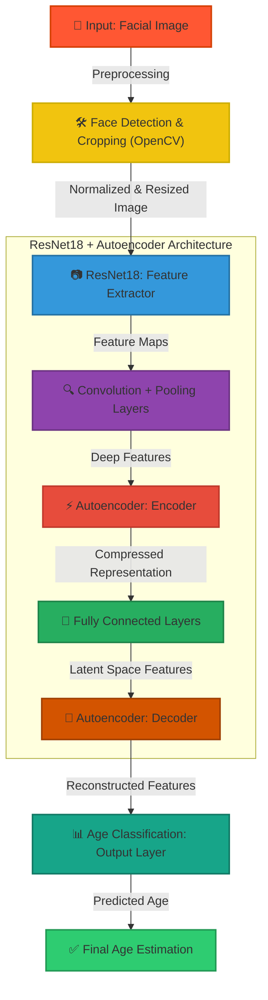
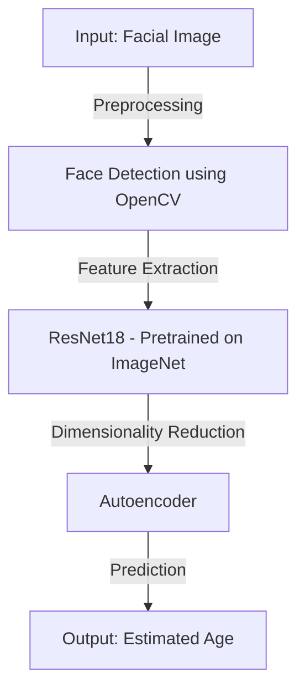

# 🎯 Age Prediction using ResNet18 with Autoencoder


---


## 🚀 Project Overview

The **Age Prediction System** utilizes a combination of **ResNet18** and an **Autoencoder** to estimate a person’s age from their facial image. ResNet18 serves as a **feature extractor**, while the **autoencoder** helps in dimensionality reduction, enhancing the model's learning efficiency.

> ✨ **Why This Approach?**
> - **ResNet18 as Feature Extractor** – Leverages pre-trained knowledge from ImageNet for robust facial representations.
> - **Autoencoder for Dimensionality Reduction** – Helps in efficient feature extraction and generalization.
> - **Robust to Variations** – Handles different facial expressions, lighting, and orientations.

---

## 🔥 System Architecture Diagram



---

## ✨ Key Features

✅ **ResNet18 for Feature Extraction** – Uses a pretrained model for deep feature learning.  
✅ **Autoencoder for Dimensionality Reduction** – Learns compact face representations.  
✅ **Facial Detection using OpenCV** – Automatically detects and crops faces before processing.  
✅ **Real-Time Age Prediction** – Supports live webcam input as well as static images.  
✅ **Optimized Training Pipeline** – Includes data augmentation and preprocessing.  

---

## 📌 Model Architecture

### **🔹 ResNet18 Feature Extractor**

```python
class ResNet18PlusAE(nn.Module):
    def __init__(self):
        super(ResNet18PlusAE, self).__init__()
        self.resnet = models.resnet18(pretrained=True)
        self.resnet.fc = nn.Identity()  # Remove the final classification layer
```

### **🔹 Autoencoder for Feature Compression**

```python
class AutoEncoder(nn.Module):
    def __init__(self):
        super(AutoEncoder, self).__init__()
        self.encoder = nn.Sequential(
            nn.Conv2d(3, 16, 3, stride=2, padding=1),
            nn.ReLU(),
            nn.Conv2d(16, 32, 3, stride=2, padding=1),
            nn.ReLU(),
            nn.Conv2d(32, 64, 3, stride=2, padding=1),
            nn.ReLU(),
            nn.Flatten(),
            nn.Linear(64 * 28 * 28, 512),
            nn.ReLU()
        )
```

### **🔹 Training Configuration**
- **Data Augmentation** – Rotation, flipping, and cropping applied for dataset diversity.
- **Optimizer** – Adam Optimizer with a learning rate of **0.0001**.
- **Loss Functions**:
  - **Reconstruction Loss** (MSE) for autoencoder training.
  - **Mean Absolute Error (MAE)** for age prediction.
- **Training Duration** – 20 epochs.

---

## 🛠️ Tech Stack

| Deep Learning  | Computer Vision | Tools & Libraries | Dataset |
|---------------|----------------|------------------|---------|
| ResNet18 + Autoencoder | OpenCV | PyTorch | UTKFace Dataset |
| Transfer Learning | Face Detection | NumPy | IMDB-WIKI Dataset |
| Data Augmentation | Webcam Input | Matplotlib | Custom Dataset |

---

## 🎯 Usage & Execution

### 📌 Prerequisites:
- **Python 3.x**
- **PyTorch, Torchvision, OpenCV, NumPy**
- **Matplotlib & Scikit-learn**

### 🛠️ Steps to Run the Project:

1️⃣ **Clone the repository:**
```bash
git clone https://github.com/your-github-username/age-prediction-resnet.git
cd age-prediction-resnet
```

2️⃣ **Install Dependencies:**
```bash
pip install -r requirements.txt
```

3️⃣ **Train the Model:**
```bash
python train_model.py
```

4️⃣ **Run Age Prediction:**
```bash
python predict_age.py
```

---

## 📸 Application Snapshots

### 📊 Training Process


### 🎥 Real-Time Age Detection


### 🔍 Model Performance Evaluation


---

## 💡 **Future Enhancements**
✨ **Integration with Gender & Emotion Recognition**.  
✨ **Deploy as a Web App using Flask or FastAPI**.  
✨ **Support for Video-Based Age Estimation**.  
✨ **Optimization with More Advanced CNN Architectures**.  

---

## 👥 Contributors

- [Suyash Khare]

---

## 📜 License

This project is licensed under the [MIT License](https://opensource.org/licenses/MIT). Feel free to use, modify, and distribute the code for both non-commercial and commercial purposes with proper attribution.

---

## 📞 Contact & Contribution

🤝 Want to contribute? Fork the repo and submit a PR!  
📩 **Contact:** [suyashkhareji@gmail.com](mailto:suyashkhareji@gmail.com)  
🚀 **GitHub Repository:** [Age Prediction Using ResNet18](https://github.com/your-github-username/age-prediction-resnet)

---

Now, your **Age Prediction Using ResNet18 with Autoencoder** project has a **stunning, structured, and recruiter-attracting `README.md`**. 🚀🔥 Let me know if you'd like further refinements!
