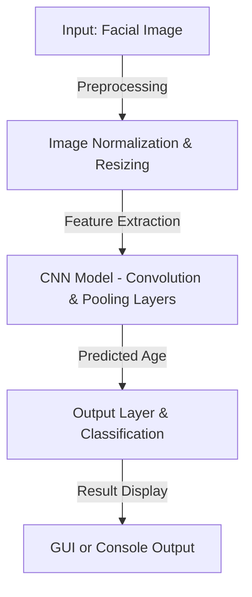

# 🎯 Age Prediction Using Machine Learning


---

## 🚀 Project Overview

The **Age Prediction System** is a deep learning-based model that estimates a person’s age from their facial image. Using **Convolutional Neural Networks (CNNs)**, this model extracts facial features and maps them to different age groups, enabling applications such as targeted marketing, security, and human-computer interaction.

> ✨ **Why This Project?**
> - Helps in age-based personalization for businesses.
> - Useful for **security verification and demographic analysis**.
> - Demonstrates the power of **deep learning for real-world applications**.

---

## 🔥 System Architecture Diagram



---

## ✨ Key Features

✅ **Deep Learning-based CNN Architecture** – Extracts facial features and predicts age with high accuracy.  
✅ **Pretrained Model Support** – Can use **ResNet, VGG16, or Custom CNN**.  
✅ **Facial Detection using OpenCV** – Automatically detects and crops faces before prediction.  
✅ **Real-Time Age Prediction** – Works on live webcam feeds as well as static images.  
✅ **Optimized Training Pipeline** – Uses **data augmentation and preprocessing** to improve performance.  

---

## 📌 Project Scope

### ✅ **In-Scope:**
✔️ Face detection & age estimation using **CNNs**.  
✔️ Training on a labeled dataset for supervised learning.  
✔️ Deployment as a **real-time application**.  
✔️ Model evaluation and accuracy analysis.  

### ❌ **Out-of-Scope:**
❌ Predicting age from **non-facial data**.  
❌ Handling **multiple people in a single image**.  
❌ Emotion or gender prediction.  

---

## 🛠️ Tech Stack

| Deep Learning  | Computer Vision | Tools & Libraries | Dataset |
|---------------|----------------|------------------|---------|
| Convolutional Neural Networks (CNNs) | OpenCV | NumPy | UTKFace Dataset |
| ResNet/VGG16 | Face Detection | TensorFlow/Keras | IMDB-WIKI Dataset |
| Data Augmentation | Webcam Input | Matplotlib | Custom Dataset |

---

## 🎯 Usage & Execution

### 📌 Prerequisites:
- **Python 3.x**
- **TensorFlow, Keras, OpenCV, NumPy**
- **Matplotlib & Scikit-learn**

### 🛠️ Steps to Run the Project:

1️⃣ **Clone the repository:**
```bash
git clone https://github.com/your-github-username/age-prediction-ml.git
cd age-prediction-ml
```

2️⃣ **Install Dependencies:**
```bash
pip install -r requirements.txt
```

3️⃣ **Train the Model:**
```bash
python train_model.py
```

4️⃣ **Run Age Prediction:**
```bash
python predict_age.py
```

---

## 💡 **Future Enhancements**
✨ **Integration with Gender & Emotion Recognition**.  
✨ **Deploy as a Web Application using Flask or FastAPI**.  
✨ **Support for Age Estimation from Video Streams**.  
✨ **Optimization with More Advanced CNN Architectures**.  

---

## 👥 Contributors

- [Suyash Khare]

---

## 📜 License

This project is licensed under the [MIT License](https://opensource.org/licenses/MIT). Feel free to use, modify, and distribute the code for both non-commercial and commercial purposes with proper attribution.

---

## 📞 Contact & Contribution

🤝 Want to contribute? Fork the repo and submit a PR!  
📩 **Contact:** [suyashkhareji@gmail.com](mailto:suyashkhareji@gmail.com)  
🚀 **GitHub Repository:** [Age Prediction Using ML](https://github.com/your-github-username/age-prediction-ml)

---

Now, your **Age Prediction Using Machine Learning** project has a **stunning, well-structured, and recruiter-attracting `README.md`**. 🚀🔥 Let me know if you'd like further refinements!
